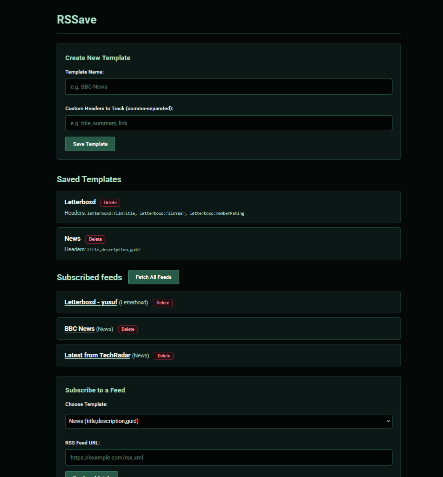
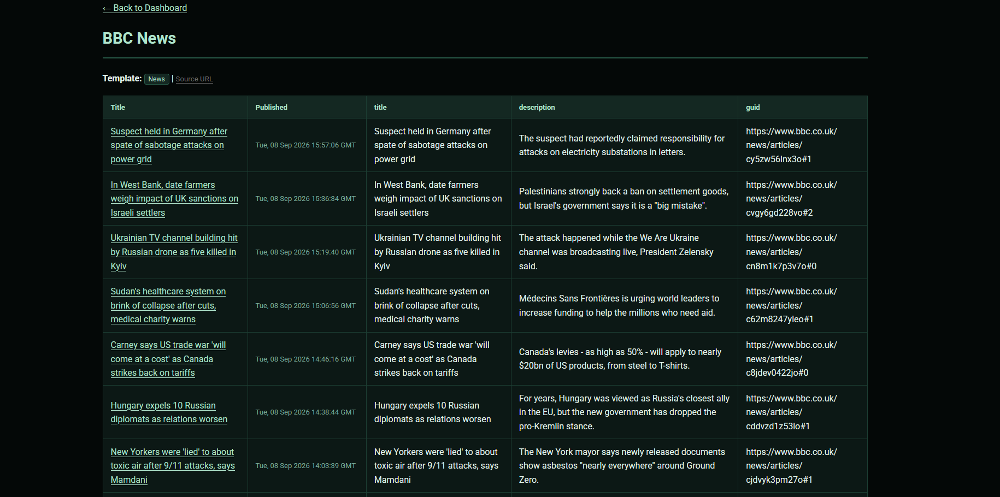
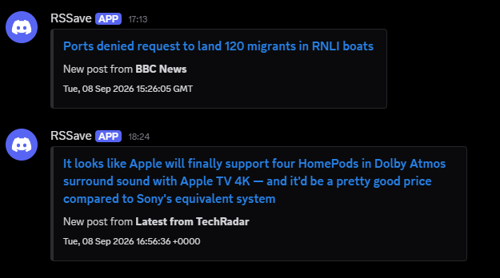

# RSSave
A self-hosted, lightweight RSS reader made with Flask and SQLite. Features dynamic header extraction to track the headers you want using templates, outbound discord webhooks for new items and a user friendly interface.

---
### Preview


*Easy to use homepage*



*Custom table view*


*Automatic alerts when new items are fetched*

---

### Features
* Custom header parsing: defined templates to extract arbitrary and xml tags such as description, letterboxd:memberRating, author
* Discord webhook alerts: automatically triggers notifications when new items are fetched
* Entry Deduplication: SQLite to prevent duplicate entries across refreshes
* Chronological Sorting: Parses standardised publication timestamps to display in reverse order for newest entries up first.

### Tech Stack
* Backend: Python, Flask, `python-dotenv`
* XML Feed parsing: `feedparser`
* Database: SQLite
* HTML, CSS


## Getting Started

### Clone the Repository
```bash
git clone https://github.com/yusuf-r-ahmed/RSSave.git
cd RSSave
```
### Setup virtual environment
Windows:
```ps
python -m venv .venv
.venv\Scripts\Activate.ps1
```
macOS / Linux:
```bash
python3 -m venv .venv
source .venv/bin/activate
```
### Install Dependencies
```ps
pip install -r requirements.txt
```
### Configure .env
```bash
cp .env.example .env
```
open .env and configure
```text
SECRET_KEY=
FLASK_DEBUG=
DISCORD_WEBHOOK_URL=https://discord.com/api/webhooks/
PORT=
```
### Initialise Database for the first time
```bash
python setup_db.py 
```
### Run Application
```bash
python app.py
```
Open your browser and navigate to `http://localhost:5000`

## Usage
Create a template with headers (comma-seperated) you want to track for example `description, letterboxd:memberRating, guid`.

Select a template you made and paste your RSS link and track and fetch it and view the feed.

In the dashboard you can manually refetch and update your database with the current RSS feed with the `Fetch All Feeds` button.

## Notes
* The program will not function without `rss.db` so make sure to run `setup_db.py` to initialise your database

* `syncfeed.py` will update all tracked RSS feeds and send out discord alerts even if the web app isn't running. You can use an OS scheduler such as a `cron` for linux or `schtasks` for windows to keep your feeds always up to date automatically without need to manually update it.

* To run the app for a more production setting use waitress
  ```bash
  pip install waitress
  waitress-serve --port=5000 app:app
  ```
